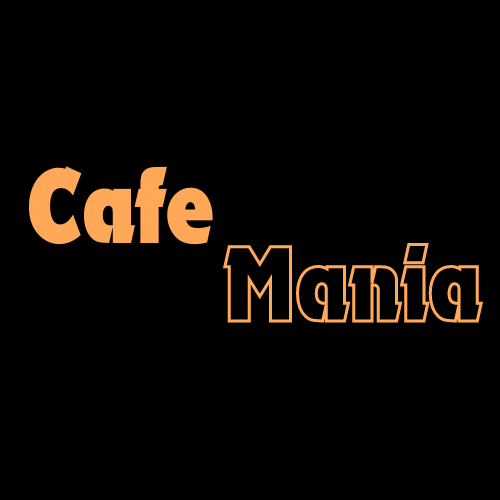

# Café Mania - Café Restaurant Management and Online Ordering Site

Welcome to **Café Mania**, your ultimate café restaurant management and online ordering solution. Whether you're running a bustling café or looking to order your favorite coffee from the comfort of your home, Café Maia has got you covered.



Visit here : https://cafe-mania-c9a90.web.app/

## Overview

Café Mania is designed to streamline the management of your café while providing customers with a seamless online ordering experience. From managing menus and orders to tracking sales and customer feedback, Café Maia is built to enhance every aspect of your café business.

## Features

- **Restaurant Management:**
  - Menu creation and updates
  - Order tracking and management
  - Sales analytics and reporting
  - Customer feedback collection

- **Online Ordering:**
  - Browse and search menu items
  - Add items to the cart and customize orders
  - Secure checkout and payment processing
  - Order history and tracking

- **User Accounts:**
  - Secure user authentication and authorization
  - User profiles with order history
  - Password recovery and account management

- **Admin Dashboard:**
  - Manage products, categories, and inventory
  - View and process orders in real-time
  - Generate sales reports and analytics

## Technologies Used

- **Frontend:**
  - React.js
  - Bootstrap
  - CSS

- **Backend:**
  - Node.js
  - Express.js
  - MongoDB

- **Authentication:**
  - JSON Web Tokens (JWT)

- **Payment Processing:**
  - [Payment Gateway Integration]

## Setup Instructions

### Prerequisites

- Node.js
- MongoDB

### Installation

1. **Clone the repository:**
   ```bash
   git clone https://github.com/your-username/cafe-maia.git
   cd cafe-maia
